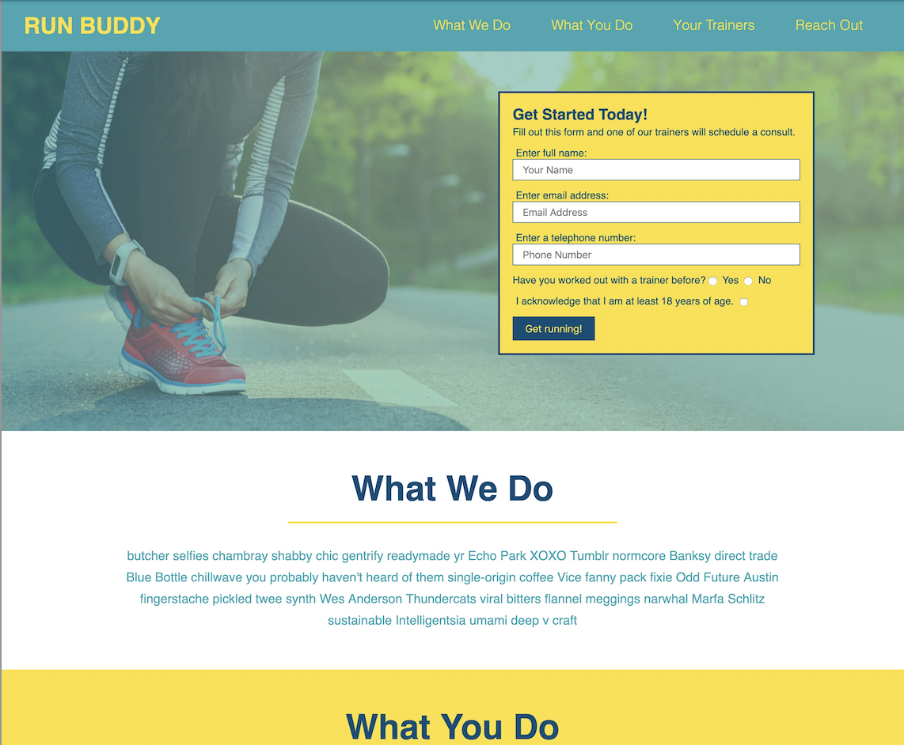
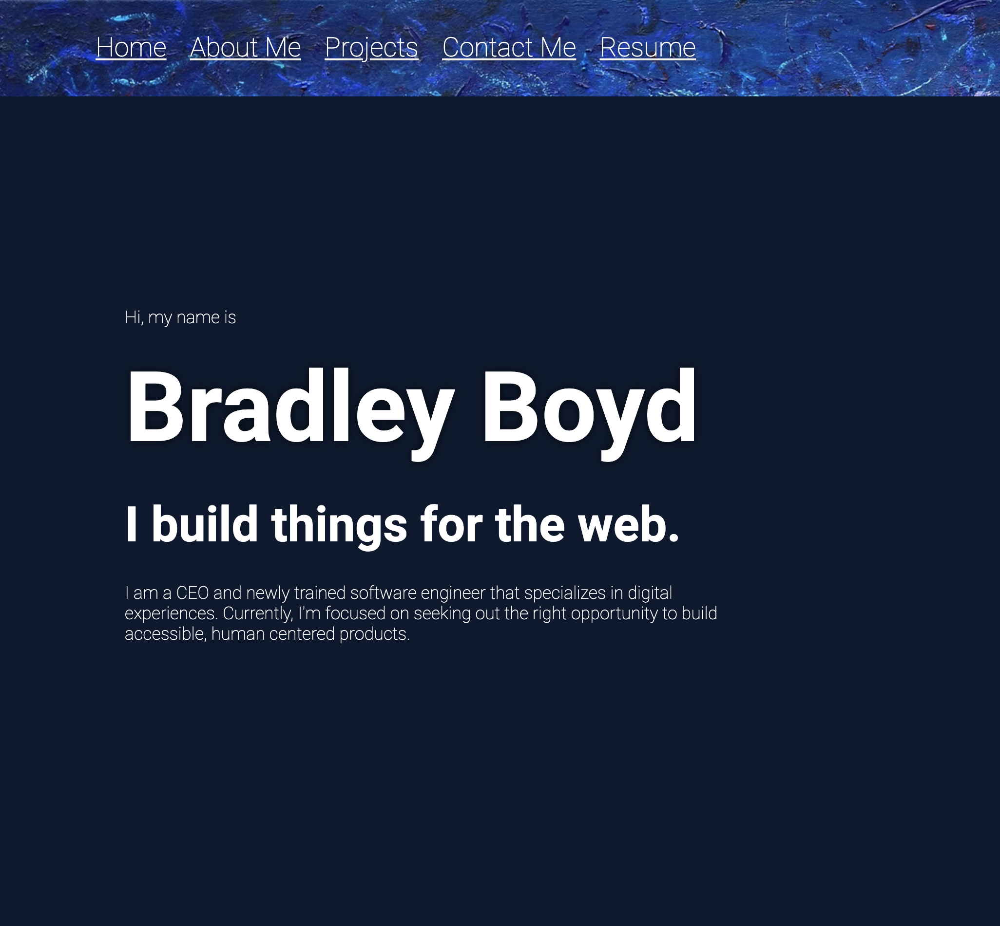

# Build Developer Portfolio

Application live URL: https://houst29476.github.io/portfolio/

GitHub Repository URL: https://github.com/Houst29476/portfolio

Developer Portfolio

Functionality Requirements:
    - Display portfolio of work Samples
    - Developer Bio
        - Name
        - Photo
        - About Me (bio)
        - Project work history
        - Contact Info

    - Navigation to corresponding sections
    - About my work
    - Titled images of developer’s applications
    - Presentation of Applications
        - highlighted presentation, image should be larger than others
        - When user clicks on image, takes user to deployed to application
    - Mobile layout Optimized 

After writing & organizing the HTML and CSS code, the blow have been checked and completed:

    - All links function correctly.

    - Applications CSS selectors and properties are consolidated and organzied.
        - follows semantic structure.
    
    - Applications CSS file is properly commented.

    - Application has been deployed at live URL.

    - Application loads with no errors.

    - GitHub repository contains the application code.

    - Application resembles provided screenshots and challenge instructions.

    - GitHub repository has a unique name

    - Best practices for File structure, Class/ID naming conventions, indentation, and quality comments have been applied to code and repository.

    -  Repository contains multiple descriptive commit messages for each update to the repository.

    - This README file is included describing the changes and updates that have been made to the original source code. A screen shot and link to deployed application are included as well.

Application Images:

